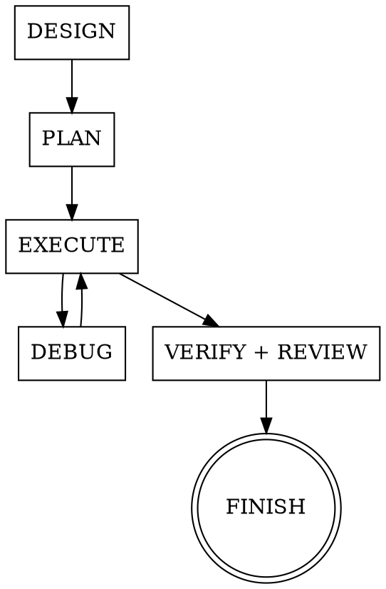

# Integrated Workflow

This skill is the map. It weaves the **Superpowers** skills together with the
**grilling** and **domain-modeling** skills into one development lifecycle, and
declares when each phase must auto-invoke another skill. Follow it whenever you
start substantive work — it tells you which skill you are in and what to reach
for next.

These libraries are complementary, not competing:

- **Superpowers** owns the end-to-end pipeline (design → plan → execute → debug → verify → review → finish).
- **grilling** supplies relentless one-question-at-a-time interrogation.
- **domain-modeling** supplies durable artifacts: a glossary (`CONTEXT.md`) and ADRs (`docs/adr/`).

## The lifecycle

- **DESIGN** = `brainstorming` (owner) + `grilling` (interrogation) + `domain-modeling` (capture terms/decisions)
- **PLAN** = `writing-plans`, reading the design + `CONTEXT.md` + `docs/adr/`
- **EXECUTE** = `executing-plans` / `subagent-driven-development` + `test-driven-development`
- **DEBUG** = `systematic-debugging`
- **VERIFY + REVIEW** = `verification-before-completion` + `requesting-code-review` / `receiving-code-review`
- **FINISH** = `finishing-a-development-branch`

## Auto-invocation rules

When you are in the left-hand situation, you MUST also invoke the skill on the
right. This is what makes the libraries work in tandem.

| When you are… | Also invoke… | Why |
|---|---|---|
| In `brainstorming`, at the clarifying-questions step | `grilling` | Ask one relentless question at a time, with a recommended answer each time, instead of a shallow pass |
| In `brainstorming` or `grilling`, and a term or decision crystallises | `domain-modeling` | Capture it immediately: glossary term in `CONTEXT.md`, or an ADR in `docs/adr/` |
| A `grilling` / `grill-with-docs` session reaches shared understanding | `brainstorming` → `writing-plans` | Formalise the interview into a spec and a plan; don't stop at the interview |
| Starting `writing-plans` | read `CONTEXT.md` + `docs/adr/` first | The plan must use the ubiquitous language and honour recorded decisions |
| In `executing-plans` / `test-driven-development`, a hard-to-reverse decision or a new domain term appears | `domain-modeling` | Record the ADR / update the glossary inline, while the context is fresh |
| In `systematic-debugging`, the root cause is a domain-model misunderstanding | `domain-modeling` | Fix `CONTEXT.md`, and add an ADR if the corrected decision is hard to reverse |
| In `requesting-code-review` / `receiving-code-review` | check the diff against `CONTEXT.md` + `docs/adr/` | Review enforces the ubiquitous language and the recorded decisions |
| In `verification-before-completion` | confirm `CONTEXT.md` / `docs/adr/` reflect decisions made | Evidence before assertions: decisions made must have left docs behind |

## Artifact map (single source of truth)

Each document has exactly one owner skill and one location. Do not duplicate
these or invent parallel paths.

| Document | Owner skill | Path |
|---|---|---|
| Glossary / ubiquitous language | `domain-modeling` | `CONTEXT.md` (repo root) |
| Architecture Decision Records | `domain-modeling` | `docs/adr/NNNN-*.md` |
| Design specs | `brainstorming` | `docs/superpowers/specs/YYYY-MM-DD-<topic>-design.md` |
| Implementation plans | `writing-plans` | per that skill |

`CONTEXT.md` stays a pure glossary — no implementation detail, no spec content.
Specs and ADRs are separate; specs describe what to build, ADRs record why a
hard-to-reverse choice was made.

## Conflict resolution

- **`brainstorming` vs `grilling`/`grill-with-docs`** — both interrogate a
  design, so they don't run as rivals. `brainstorming` **owns** the design phase
  and **delegates** the relentless interrogation to `grilling`. `grill-with-docs`
  is a valid user-invoked *entry point*; when it concludes, flow into
  `brainstorming`'s spec step and onward to `writing-plans` — the same pipeline.
- **User instructions win.** As `using-superpowers` states, explicit user
  instructions (including "skip the ceremony / implement directly") override
  these chaining rules. The map is the default path, not a cage.
